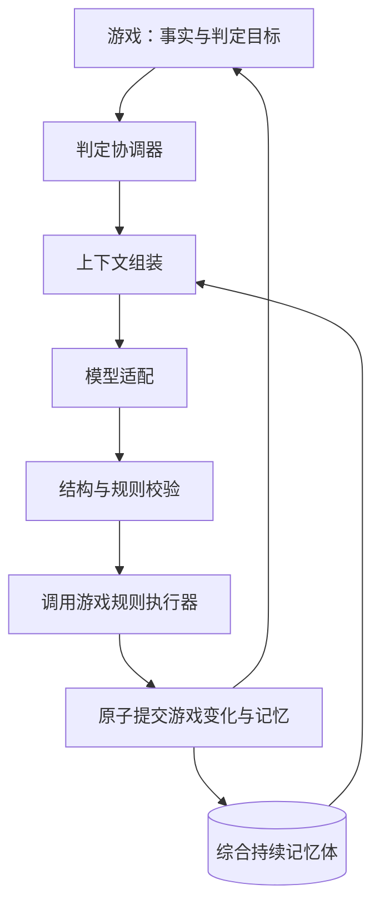

# AI 游戏框架：定义、边界与 MVP 开发规格

版本：0.4 ｜ 状态：协议说明；实现与验证状态见 [验证记录](../verification.md)

## 1. 定义

本框架是供游戏服务端嵌入的、支持持续记忆的 AI 综合判定基础设施。游戏在自身流程中选择需要AI判断的环节，提供当前事实、判定目标、允许的结果与约束；框架组织记忆、构建上下文、调用模型、校验判定，再调用游戏提供的运算与执行接口，可靠提交结果。

游戏有自己的逻辑和运算。资源消耗、战斗计算、资格判断、成长、时间推进、剧情触发由游戏负责；AI只接管游戏明确委托的部分综合判定。游戏完全可以不调用AI，独立完成确定性动作。

框架不定义题材、属性、行动、战斗公式、胜负条件或内容，也不定义游戏回合：一次游戏回合可以有零次、一次或多次框架判定请求。历史、武侠、现代战争都是外部宿主。

已确认技术栈：React + TypeScript、Node.js + Fastify + TypeScript、PostgreSQL。core作为TypeScript包；Fastify是宿主服务，React是Demo界面，均不应成为core的依赖。

待审阅MVP设计：单体、一个模型供应商、同记忆流串行、最多一次纠正调用、游戏与框架共享同一个PostgreSQL事务。本版不覆盖跨数据库原子提交。

本版本替代v0.2的游戏包DSL、通用行动/属性/终局和内置延迟效果设计；原题材验收A01～A17与TC-01～41不再是框架测试基线。

## 2. 边界

| 能力 | 框架 | 游戏宿主 |
|---|---|---|
| 真实状态 | 保存判定记录、记忆投影和版本 | 定义角色、地图、资源及其权威状态 |
| 持续记忆 | 持久化、来源、检索、作用域隔离 | 选择应记忆的事实、事件、摘要与开放事项 |
| 上下文 | 组装、去重、排序、预算 | 提供事实、候选结果、判定说明与可见范围 |
| 模型 | 适配、超时、格式纠正、用量记录 | 选择哪些环节交给AI |
| 校验 | JSON/Schema校验、调用业务验证器 | 定义业务规则、合法结果和约束 |
| 执行 | 调用注册执行器、事务、幂等、恢复 | 运算实际效果、重验前提、更新游戏状态 |
| 长期后果 | 保存事项及来源，供检索 | 决定触发时机、计算后果、关闭事项 |
| 账号与档案 | 公共identity模块提供账号、会话、单一当前档案授权 | 接入公共路由和登录组件，初始化题材状态 |

框架的“规则执行”是受控调用宿主规则，不是内置游戏规则引擎。执行器是部署时注册的受信任TypeScript代码；模型只返回受约束的数据，不能执行代码、SQL或任意属性patch。

## 3. 五层结构



### 3.1 综合持续记忆体

| 组成 | MVP能力 |
|---|---|
| 当前事实投影 | 宿主指定key、值、来源版本与可见性；按key更新 |
| 不可变事件 | 保存已提交事实、主体ID、标签、来源ID |
| 历史摘要 | 宿主提供短摘要和来源；MVP不自动调用模型压缩 |
| 开放事项 | 保存open/closed与来源，例如未完成承诺；框架不计时触发 |
| 请求记录 | 输入、提案、上下文来源、提交结果和错误；失败提案不作为事实记忆 |

真实游戏状态优先于旧摘要。宿主每次提供当前事实，框架不从叙事推导权威状态。开放事项用于持续提示，不授权AI自行触发后果。

所有记忆属于scopeId，即宿主定义的一条连续交互流，例如存档。宿主确定玩家或NPC可见范围；框架检索同时限制scope和可见性。不得仅因ID存在就读取其他scope记录。

### 3.2 上下文组装

顺序：框架输出协议→已绑定版本的基础世界观→宿主判定说明/Schema→当前事实→必需事项与来源→可选历史→玩家输入。历史和玩家文字标记为数据。

默认输入8000 token，输出预留1500，并适配模型窗口和协议开销。计数器由适配层注入。必需块不可静默截断，超预算返回CONTEXT_TOO_LARGE且不调用模型。

候选历史按宿主subjectIds/tags查询，无题材词典、无embedding。按importance降序、sequence降序、id升序排序，去重后填入预算。记录选中ID和各块预算；旧摘要不得覆盖当前事实。

### 3.3 模型适配

标准请求包含messages、outputSchema、maxOutputTokens、AbortSignal；返回rawText、model、usage（可unknown）。core不依赖特定供应商或供应商会话记忆。

正常1次调用；JSON/Schema错误最多纠正1次，业务拒绝不纠正。默认单次30秒，总处理75秒，租期90秒；网络失败不自动重试。迟到响应不可重复提交，不承诺供应商取消后不计费。

### 3.4 结构与规则校验

先检查rawText≤16KiB、严格JSON Schema和候选范围；禁止额外字段和自动类型转换。再调用无副作用的宿主validate验证业务约束。

最终事务内必须重新读取宿主状态，检查gameVersion和业务前提。等待模型期间宿主状态变化则STATE_CONFLICT，不能套用过时判定。

### 3.5 规则执行

只执行请求绑定的宿主apply回调。游戏负责计算效果，框架负责事务与记忆合法性。apply不得调用网络、模型或执行不可回滚外部动作。

MVP只保证同一PostgreSQL中的宿主数据与框架数据原子提交；跨库、外部通知与分布式事务不在范围内。

## 4. 宿主接入协议草案

```ts
type AssessmentInput = {
  scopeId: string;
  requestId: string;
  expectedMemoryVersion: number;
  bindingId: string;
  bindingVersion: string;
  input: unknown;
};
interface GameBinding {
  id: string;
  version: string;
  inputSchema: object;
  outputSchema: object;
  prepare(input: unknown): Promise<{
    gameVersion: string;
    facts: unknown;
    instructions: string;
    subjectIds: string[];
    tags: string[];
    requiredMemoryIds: string[];
  }>;
  validate(proposal: unknown, facts: unknown): ValidationResult;
  apply(tx: Transaction, proposal: unknown, context: {
    gameVersion: string; input: unknown;
  }): Promise<{ result: unknown; memoryChanges: MemoryChange[] }>;
}
```

prepare只读；apply须在tx中锁宿主记录、核对gameVersion、重验规则，再计算并写入结果。tx生命周期由框架管理。实际接口以packages/core/src/types.ts为准；prepare还接收scopeId，mode区分有AI与无AI动作。

MemoryChange仅包含replace_fact、append_event、append_summary、open_item、close_item。引用限本scope已有记录或本次新增记录。题材内容是宿主payload，框架不解释其业务含义。

当前提供mode为recordMemory的Binding（经harness.submit统一提交）：让不需要AI的游戏动作通过同样的幂等、scope锁和事务写入游戏变化与记忆，不调用模型。它使用同一requestId唯一空间，哈希还需包含操作种类assessment/recordMemory。

## 5. 生命周期与可靠性

1. 宿主完成身份和scope授权；框架校验请求结构。
2. 查询(scopeId,requestId)。同内容返回原状态/结果；不同内容IDEMPOTENCY_CONFLICT。哈希含操作种类、binding及版本、input、expectedMemoryVersion。
3. 新请求校验binding版本并领取scope处理权，创建processing；短事务立即结束。
4. prepare、记忆检索、上下文组装、模型调用、结构和业务验证。
5. 最终短事务锁scope，检查processing、租期和memoryVersion，调用apply检查宿主gameVersion并运算。
6. 校验记忆变更、提交宿主变化与记忆；memoryVersion加1，保存committed结果。
7. 失败全部回滚，独立事务保存rejected/failed；进程终止则租期扫描恢复。

结构或宿主规则拒绝为rejected；模型异常、状态冲突、数据库错误为failed。两者不改变有效记忆和游戏状态，但可保留请求/诊断记录。保证一次成功提交，不保证回滚尝试中apply从未执行。

同scope串行，不同scope并行；模型等待期间不保留数据库事务或行锁。启动和定时扫描清理到期processing为PROCESSING_EXPIRED。迟到执行者不能覆盖新请求。原结果未知先查询原ID，明确失败后重试用新ID。

## 6. PostgreSQL 与 Web

| 框架表 | 内容 |
|---|---|
| fw_scopes | id、memory_version |
| fw_requests | scope_id/request_id、hash、binding版本、status、lease_expires_at、input/proposal/result JSONB、错误 |
| fw_facts | scope_id/key、payload、source_version、visibility |
| fw_events | id、scope_id、request_id、sequence、subject_ids/tags、importance、visibility、payload、source_ids |
| fw_summaries | scope_id、payload、source_ids/version、visibility |
| fw_open_items | scope_id、status、payload、source_ids、visibility |
| fw_model_calls | request、attempt、model、usage、latency、context_ids、error |

宿主另有自己的游戏表。request对(scope_id,request_id)唯一；processing对scope部分唯一；事件对(scope_id,sequence)唯一。最终事务分配递增sequence。普通列用于索引、关联与状态，JSONB承载不透明payload。跨scope引用在应用层和仓储边界检查。

建议宿主API：POST /api/assessments→202；GET /api/assessments/:requestId→200含终态。scope必须经宿主授权；处理中重复202，终态重取200，忙/版本/幂等冲突409，输入错误400，不存在404。

错误码：INVALID_INPUT、SCOPE_BUSY、VERSION_CONFLICT、IDEMPOTENCY_CONFLICT、BINDING_MISMATCH、MODEL_INVALID_OUTPUT、RULE_REJECTED、MODEL_TIMEOUT、MODEL_UNAVAILABLE、CONTEXT_TOO_LARGE、STATE_CONFLICT、PROCESSING_EXPIRED、INTERNAL_ERROR。业务原因置于受控detail.code，core不硬编码游戏错误。

单体Fastify加PostgreSQL；React页面属于Demo。MVP在本机或受控测试环境验收；公网身份、授权、限流由宿主另行实现。

## 7. MVP 与文档顺序

包含五层结构、协调器、宿主接口、非AI记忆写入、事务/恢复、Mock、单供应商适配、独立Quickstart。

排除游戏DSL、通用行动/战斗/回合/终局、框架自动触发剧情、模型任意改状态、自动摘要/向量库、多模型路由、多人同步、内容编辑器和跨库事务。

成功标准：中性宿主完成判定；重启保留事实与开放事项；非法输出/冲突无副作用；无AI动作也能写记忆；更换宿主不修改core。

审阅顺序：本规格→[框架测试规格](../testing/framework.md)→[中性数据契约](../testing/fixtures.md)→[武侠Quickstart](../../mods/qingxi/README.md)→[Demo测试与数据](../../mods/qingxi/tests/README.md)。框架测试先于实现；Demo测试依照独立游戏文档生成，不反向定义框架规则。

依赖由package-lock.json锁定，运行/测试环境由根目录compose.yaml定义；真实供应商配置和公网部署仍待定。当前已开始MVP实现；Docker运行与真实模型验收需独立记录，不能从协议文档推定通过。

## 实现布局说明

四类记忆在当前实现中合并为fw_memory，通过kind区分；fw_scopes、fw_requests、fw_model_calls独立保存。上表为逻辑职责，并非每项必须有独立物理表。当前scope授权由宿主承担，游戏规则在mods/qingxi。架构不变量以[ARCHITECT.md](../../ARCHITECT.md)为准。


