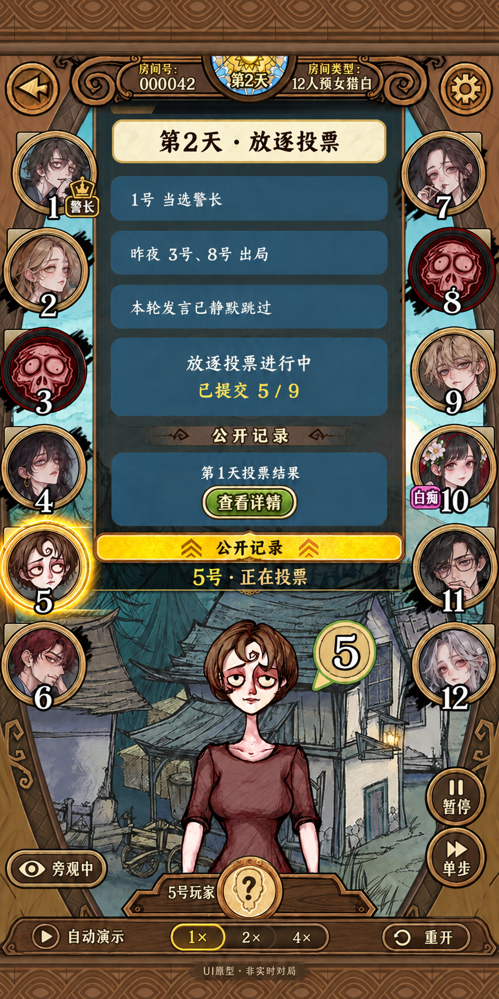

# 狼人杀旁观UI原型 v1

状态：用户已确认并要求实施。归属：[需求001](../.agents/note/001-ai-spectator-mvp.md)。本次仅为设计交付，不包含应用实现、接口、部署或可执行测试。

## 设计方向与参考

用户2026-09-21提供的网易狼人杀1080×2160截图是本版视觉参考，明确要求尽可能复刻。采用相同的竖屏空间分配、木质雕花框、金铜圆形头像、左右各六席、蓝灰记录卡、金色消息条、下方人物立绘与哥特村庄背景。原型内房间号、人物、名单及战报均为展示数据，不代表当前运行中的真实对局。

画面由内置imagegen生成并经一次文本校正；原型图用于视觉评审，正式前端仍需拆分背景、边框、头像、立绘和控件，文本与状态由真实组件渲染，不能把整张图片铺作可操作页面。生成提示词留存在[制作记录](prototypes/ui-v1-prompts.md)。

## 主画面布局

按参考图约1:2竖屏比例组织，建议逻辑画布432×864，交付图只作为比例/风格依据。

| 区域 | 位置与表现 | 内容 |
|---|---|---|
| 房间抬头 | 顶部约12%，木牌、螺旋雕饰、太阳/月亮徽章 | 返回、房间号、第几天/夜、12人预女猎白、显示设置 |
| 十二席 | 左1–6，右7–12，各占约20%宽度，席位永不重排 | 金铜头像框、黑描边白数字、公开状态角标 |
| 中央记录 | 中间约60%宽度，上半部 | 奶油色阶段提示、蓝灰战报、金色重要数字、投票详情入口 |
| 当前状态 | 金色公开记录条及其下方暗色窄条 | 当前公开行动，例如“5号 · 正在投票”；不显示虚构倒计时 |
| 角色展示 | 下半部中央，旧村庄背景前 | 当前或选中席位的装饰性立绘、座位徽章与身份问号 |
| 演示控制 | 下方两枚铜质圆按钮及底部木条 | 暂停/继续、单步、1×/2×/4×、重开；旁观状态标识 |

头像和立绘只表示外观，不按隐藏角色分配可识别的职业服装。大立绘沿用参考图的夸张头身比与手绘笔触。当前界面为无座位旁观，不设置“你已经死亡”“你”的标签。界面身份问号在正常终局后才揭示。

## 材质、字体与颜色

- 保留厚木框、斜向木纹、压印菱形装饰、螺旋雕刻与双层铜边，避免平面网页卡片风格。
- 主色建议：深木棕#52341F、铜金#BD8B49、暗青#233D43、战报蓝灰#365F72、羊皮纸#F2E6BA；高亮为金黄#FFD24D，死亡状态暗红#872525。
- 字体采用清晰的中文宋体/楷意衬线风格，数字粗体并加深色描边。实际实现保持文字独立可选取，移动端正文不低于14px，重要阶段不低于20px。
- 高亮使用柔和金色晕光，换昼夜时短暂渐变；不用长时间震屏或闪烁。可在显示设置关闭动效。
- 手机尽量完整呈现十二席；过矮屏幕允许房间整体纵向滚动。中央记录单独滚动，头像和底部控制不随日志消失。桌面居中保留竖屏舞台，外侧延续深色木纹，不拉成横向管理面板。

## 状态与信息边界

| 状态 | 表现 | 信息约束 |
|---|---|---|
| 存活、身份未知 | 人物头像、铜金边、无职业牌 | 不展示暗身份或未经公布的死亡 |
| 当前公开行动 | 金色光圈，状态条显示席位和动作 | 夜间不高亮真实行动座位 |
| 已公开死亡 | 暗红黑框与骷髅标记，座位保留 | 不用不同死因图案暗示刀杀/毒杀 |
| 白痴翻牌 | 存活头像加紫色白痴牌 | 不使用死亡图标；从有效投票人数中排除 |
| 警长 | 金色警徽角标 | 移交或流失后及时更新 |
| 夜间 | 木框不变，冷蓝背景与月亮徽章 | 只写“夜间行动”，不暴露谁正在用药/查验/下刀及其进度 |
| 暂停/异常 | 状态条提示暂停或暂不可继续 | 不视为终局，不揭示角色，不显示内部错误或调试数据 |
| 正常终局 | 胜负横幅，头像角色牌揭示 | 才开放身份、夜间行动和完整回放 |

示意画面：3、8号已公开出局，10号为已翻牌但存活的白痴，因此有效放逐投票人数为9；“已提交5/9”是提交席数，不是加权票数。警长1.5票只在结算统计中体现。示意首两条记录按“竞选结果→公布夜死”排列，不改变已确认的结算顺序。

## 静默自动对局与交互

- 当前阶段使用固定/随机策略，无外部模型、语音或聊天输入。发言与遗言仍经过规则阶段，但显示一条“本轮发言已静默跳过”，不制造角色台词；内部各席位的空文本事件可在UI合并呈现。
- 点击头像只切换查看席位的公开资料与装饰立绘，不接管其行动、不进入其私密视角。
- 点击“公开记录”展开/收起记录区，保留最近阶段摘要；用户上翻历史时不强制滚回底部，提供回到最新入口。
- “查看详情”打开同材质羊皮纸弹层。放逐结算后显示谁投给谁、弃票、未举牌、加权票数及PK结果；警长竞选只显示公开结果，不展示进行中的或未授权的个人警长票。
- 暂停只控制演示推进；单步用于暂停时推进一个动作/结算检查点，白天展示公开结果，夜间保持统一遮蔽。倍率控制展示节奏，不改变规则、随机种子或决策结果。
- 重开先确认，再创建新演示局。种子/固定或随机策略可放在重开面板；本次不在主画面放技术调试参数。
- 齿轮仅含显示/动效/播放偏好；不放模型配置。麦克风、红包、弹幕、送礼和真人投票按钮不进入本版。
- 正常终局后底栏切换为“查看身份 / 完整回放 / 再来一局”。回放可按日夜切换，仍采用同一舞台结构。

## 原型与后续开发边界

本次交付为静态高保真原型及交互说明，按钮尚不可点击。本次不实现HTTP路由、模拟控制接口、持久化、新的调度策略或UI组件，也不修改现有游戏规则。

现有纯引擎已能运行无模型固定/随机操作整局，但实时公开进度、播放控制与浏览器展示尚未装配。UI确认后，在本需求中明确浏览器/宿主装配方式、公开DTO、演示会话及控制权限、固定种子和节奏控制、错误恢复与对应验收方案，再在用户确认的实现范围内推进。视觉原型中的5/9进度不能直接用内部Room对象拼出；夜间与抢占私有状态必须由公开数据契约隔离。

## 本版审阅项

1. 是否采用该木质哥特风格及接近参考图的密度，而非简化网页样式。
2. 是否保留下半部大立绘，并以公开记录作为中央主要信息。
3. 是否采用静默旁观＋暂停/单步/倍率/重开这一组演示控制。

## 视觉验收清单

- 十二席顺序固定，1–6在左、7–12在右，号码不被角标遮挡。
- 白痴存活与死亡状态可区分，未知身份不被头像或立绘泄露。
- 夜间不显示行动者、私密动作名、刀口、药品、查验或分通道进度。
- 主画面材质、构图、头像尺寸、记录卡和金色横条与参考图接近。
- 投票详情、终局和回放按上述信息边界设计；这些状态本次以文字定义，尚无独立效果图或可执行验收。
- UI确认记录：2026-09-21用户“确认，写入文档，1:1产出UI”。

## UI实施确认与验收（2026-09-21）

用户已回复“确认，写入文档，1:1产出UI”，本原型及交互转入实施。原文中“尚不可点击”等描述为原型交付时状态，最新实施进度见需求001。

- UI-01：独立/狼人杀页面呈现约1:2舞台、雕花木框、十二席、中央战报、金色状态条与下方角色展示；按图位置核对，文字/按钮为真实DOM。
- UI-02：初始示意画面明确为预览，开始后由真实纯引擎推进到终局；不调用模型、不使用数据库，固定种子重开得到同一决策结果。
- UI-03：暂停停止后续步进，单步仅执行一次，倍率只影响节奏；重复修订号请求不重复出局，冲突修订拒绝，失败不修改原会话。
- UI-04：未知会话拒绝；夜间响应不含隐藏身份、细分行动者、刀口/药品/查验、未来事件；预览仅含公开展示数据。正常结束才返回角色与完整已发生事件。
- UI-05：头像选择、设置、投票明细、重开确认、终局身份及按日夜回放可用；短屏/手机和桌面无水平溢出，十二席不随记录滚动消失。
- UI-06：原MUD入口保持可用；类型检查、仓库检查、单元测试及前端构建通过。浏览器实际点击验证，截图对照原型记录实际差异，不宣称截图逐像素一致。
